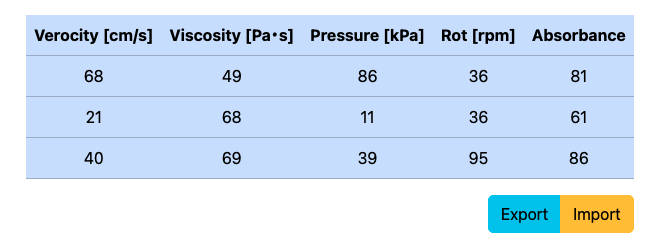

# The SAPUS Framework

SAPUS is a set of universal design components based on react-bootstrap and bootstrap-icons. It implements context-based data controls such as icon button, dropdown with multiple keys, item slider and date range selector.


It empowers you to build rich frontend components which require better user experiences to display various bussiness logics
(transactions, invoices, statics, etc.) on your web applications.
The components contained in the framework are inspired by, and aim to focus on achieving the [Human-Centered Design](https://www.hcdnet.org/en/).

For component-level documentation, see [stories](https://g1eng.github.io/sapus-framework).

# Install

```shell
npm install sapus
```

or 

```shell
yarn add sapus
```

# Requirement

React >= 19.0.0

# Features

## Icon for Actions


Emphasize universal design icons and its associated action with [IconControl](https://g1eng.github.io/sapus-framework/?path=/docs/toolsets-iconcontrol--docs) and add arbitrary actions to them! You can also create a button to open toolbox with IconToolbox to select an additional option or a submenu.


## User-friendly Date Selection


SAPUS provides two date selector components [DateSelector](https://g1eng.github.io/sapus-framework/?path=/docs/toolsets-dateselector--docs) and [DateSlider](https://g1eng.github.io/sapus-framework/?path=/docs/toolsets-dateslider--docs). Both of them are designed to be stress-free implementations of date selection, rather than OS-default (or browser default) date pickers and they are suitable for all generation.

## Flexible Data Representation in Table



The [DataTable](https://g1eng.github.io/sapus-framework/?path=/docs/replesentations-datatable--docs) component realizes modifiable table elements. It exposes data properties so you can import/export table data for your business logic. See implementation example and try it on your own.


## Recognizable Item Selection


Selected values are always displayed on [CategoryDropdown](https://g1eng.github.io/sapus-framework/?path=/docs/toolsets-categorydropdown--docs). You can use [MultiCatetoryDropdown](https://g1eng.github.io/sapus-framework/?path=/docs/toolsets-multycategorydropdown--docs) for the selection of cross conditions. Make confusion-free UI to assist users to make more precise and easy works.

## Picture with Action


You can also set the action for a [Picture](https://g1eng.github.io/sapus-framework/?path=/docs/replesentations-picture--docs). However it provides built-in animation on tapping/clicking, you can define the hook function which fires on the touch. The [PictureGrid](https://g1eng.github.io/sapus-framework/?path=/docs/implementation-examples-picturegrid--sample-picture-grid) example provides image picker by the component. Check it!


# Browser Compatibility

WIP 

# Accessibility

Sorry, accessibility support is not provided yet.


# Author

Nomura Suzume 
